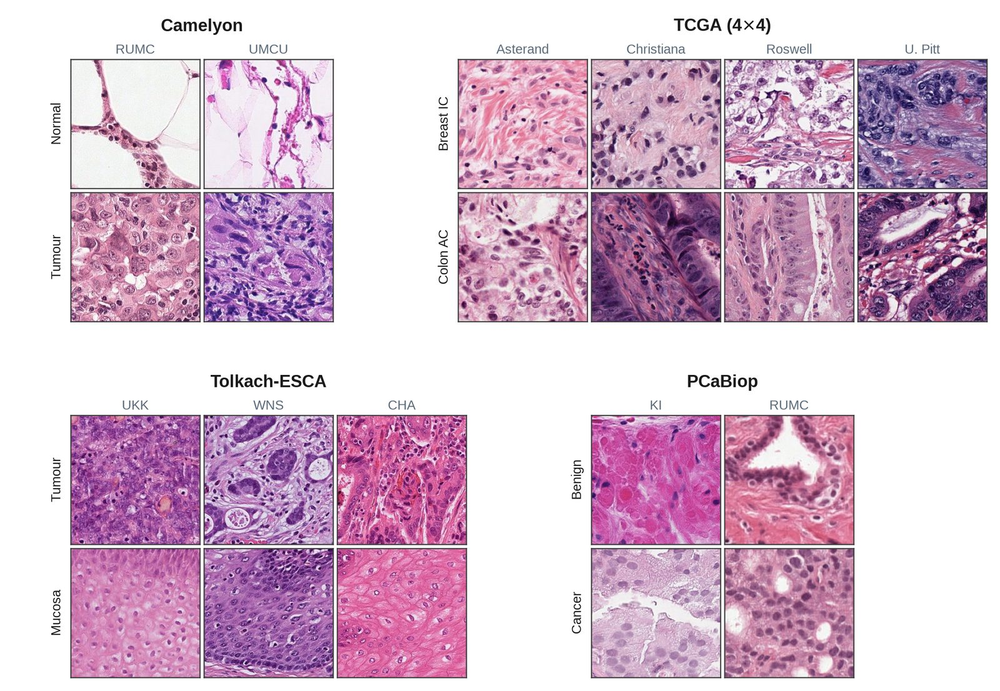

Datasets
========

The cohorts ``croma`` is evaluated on. Each pairs a biological label with a non-biological
confounder -- the medical center that contributed the sample -- so that a representation
organizing by center rather than by biology is visible as a low score rather than hidden
inside an accuracy number.

.. list-table::
   :header-rows: 1
   :widths: 22 10 30 20 18

   * - Benchmark
     - Level
     - Biological label
     - Confounder
     - Samples
   * - Camelyon
     - tile
     - breast lymph node: tumour / normal (2)
     - medical center (2)
     - 20,400 tiles
   * - TCGA-4×4
     - tile
     - cancer type (4)
     - medical center (4)
     - 5,760 tiles
   * - Tolkach-ESCA
     - tile
     - oesophageal tissue (6)
     - medical center (3)
     - 9,000 tiles
   * - PCaBiop
     - slide
     - prostate: benign / cancer (2)
     - medical center (2)
     - 1,000 slides

Camelyon, TCGA-4×4 and Tolkach-ESCA come from the
`PathoROB <https://arxiv.org/abs/2507.17845>`_ study. PCaBiop is a collection of prostate
biopsies sourced from `PANDA <https://www.kaggle.com/c/prostate-cancer-grade-assessment>`_;
it backs the paper's slide-level analyses and is evaluated on a smaller, whole-slide model
panel, so it has :doc:`its own page under Results <results/pcabiop>` rather than a row in
the tile-panel aggregate (see :ref:`the published roster <cohort-caveats>`).

What the confounder looks like
------------------------------

   The same biological class, rendered differently by different centers. Rows are
   biological classes, columns are acquisition centers. Staining, contrast and texture
   shift with the center while the biology does not -- the variation the metrics are
   designed to catch.

Balance
-------

Every benchmark is balanced across the biological class and confounder grid, so a score
cannot be driven by an uneven cell.

.. themed-figure:: _static/figures/dataset_cardinality
   :alt: Evaluated samples per biological class and confounder combination, per benchmark.

   Evaluated samples per class x center cell: 5,100 tiles for Camelyon, 360 for TCGA-4×4,
   500 for Tolkach-ESCA, and 250 slides for PCaBiop.

Building your own
-----------------

Any cohort works, provided it satisfies the :doc:`manifest contract <manifest>`: one row
per sample with a ``label``, a ``group_id``, and a confounder column of your choosing. See
:ref:`sizing` for how large the neighbourhood scope needs to be before the defaults are
usable.
